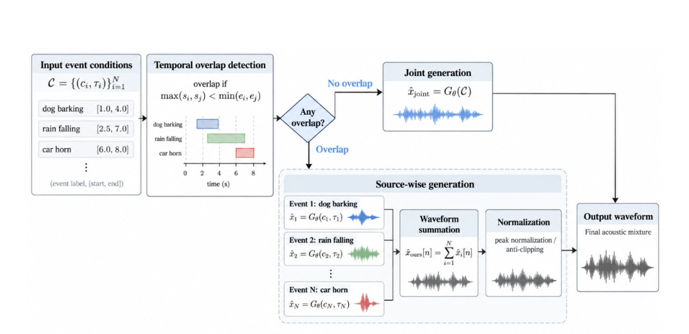

<div align="center">

# SATAG: Superposition-Aware Temporal Audio Generation

**JinHyeong Kim · DongHwan Jang · Ji-Hwan Kim**<br>
Sogang University, Seoul, Republic of Korea

[](https://julv0207.github.io/SATAG/)


</div>

## Overview

**SATAG** is a training-free inference framework for temporally controllable text-to-audio generation. Given sound descriptions and event-level timestamps, SATAG handles overlapping events through acoustic superposition and supports explicit control over their relative contributions to the generated mixture. It requires no additional training or parameter updates to the underlying model.

<p align="center">
  
</p>

For non-overlapping events, SATAG retains the original generation procedure. For overlapping events, it generates event-specific waveforms and combines them in the waveform domain. This repository provides the SATAG implementation with DegDiT, the DegDiT training code, and AudioCapsT annotations.

## Installation

```bash
git clone https://github.com/julv0207/SATAG.git
cd SATAG

python -m venv .venv
source .venv/bin/activate
pip install -r requirements.txt
```

Inference requires a trained **DegDiT checkpoint** in `.safetensors` format. The checkpoint is not bundled with this repository. TangoFlux weights, the audio VAE, and the FLAN-T5 text encoder are downloaded from Hugging Face on first use.

## Inference

### Generate audio

Run inference with the example prompts:

```bash
python infer.py \
  --checkpoint /path/to/degdit.safetensors \
  --prompt-file examples/prompts.json \
  --output-dir outputs
```

Generated audio is saved to `outputs/audio/<id>.wav` at 44.1 kHz. The file `outputs/manifest.json` records the output paths and generation mode for each sample.

The default configuration uses a 10-second duration, 50 sampling steps, and a guidance scale of 4.0. These can be changed with `--duration`, `--num-steps`, and `--guidance`. Use `--seed` to set the base random seed and `--device` to select a device; CUDA is selected automatically when available.

### Custom event conditions

Provide a JSON object, a JSON array, or a JSONL file. Each record specifies a text prompt and the onset and offset of each event in seconds:

```json
{
  "id": "dog_bird",
  "prompt": "Dog Barking from 2.24 to 6.97 and Bird Chirping from 2.24 to 6.97",
  "events": [
    {"type": "Dog Barking", "start": 2.24, "end": 6.97},
    {"type": "Bird Chirping", "start": 2.24, "end": 6.97}
  ]
}
```

Save the record to a file and pass its path with `--prompt-file`.

### Event-level mixing control

For overlapping events, add an `amplitude` value to each event to specify its relative contribution:

```json
{
  "id": "dog_bird_7_3",
  "prompt": "Dog Barking from 2.24 to 6.97 and Bird Chirping from 2.24 to 6.97",
  "events": [
    {"type": "Dog Barking", "start": 2.24, "end": 6.97, "amplitude": 7},
    {"type": "Bird Chirping", "start": 2.24, "end": 6.97, "amplitude": 3}
  ]
}
```

With explicit weights, each source is peak-normalized before weighting and summation, followed by global peak normalization of the mixture. Without weights, the sources are summed directly and only the final mixture is peak-normalized. The weights control waveform amplitude rather than a calibrated perceived-loudness ratio.

### Joint-generation baseline

SATAG applies source-wise generation automatically when events overlap. To use joint generation for all inputs, pass `--overlap-mix joint`:

```bash
python infer.py \
  --checkpoint /path/to/degdit.safetensors \
  --prompt-file examples/prompts.json \
  --output-dir outputs_joint \
  --overlap-mix joint
```

## Training

SATAG itself requires no additional training. To train the underlying DegDiT model, use the code in [`DegDiT/`](DegDiT/).

The AudioCapsT train, validation, and test annotations are provided in [`AudioCapsT/dataset/`](AudioCapsT/dataset/). The corresponding audio files must be prepared separately. Before training, update the dataset paths, audio path mapping (`audio_root_from` and `audio_root_to`), and output directory in [`DegDiT/configs/tangoflux_deg_audiocaps.yaml`](DegDiT/configs/tangoflux_deg_audiocaps.yaml).

```bash
cd DegDiT
accelerate launch --num_processes 1 train.py \
  --config configs/tangoflux_deg_audiocaps.yaml
```

## Repository Structure

```text
SATAG/
├── SATAG/              # SATAG inference and event-level mixing
├── DegDiT/             # Model, training code, and configuration
├── AudioCapsT/dataset/  # Temporal event annotations
├── docs/               # Project page and audio examples
├── examples/           # Example inference prompts
├── infer.py            # Inference entry point
└── requirements.txt    # Python dependencies
```

## Acknowledgements

This implementation builds on DegDiT and uses pretrained TangoFlux and FLAN-T5 components. We thank the authors and contributors of these projects.

## License

The code in this repository is released under the [MIT License](LICENSE). See [`DegDiT/LICENSE`](DegDiT/LICENSE) for the license accompanying the DegDiT code.
